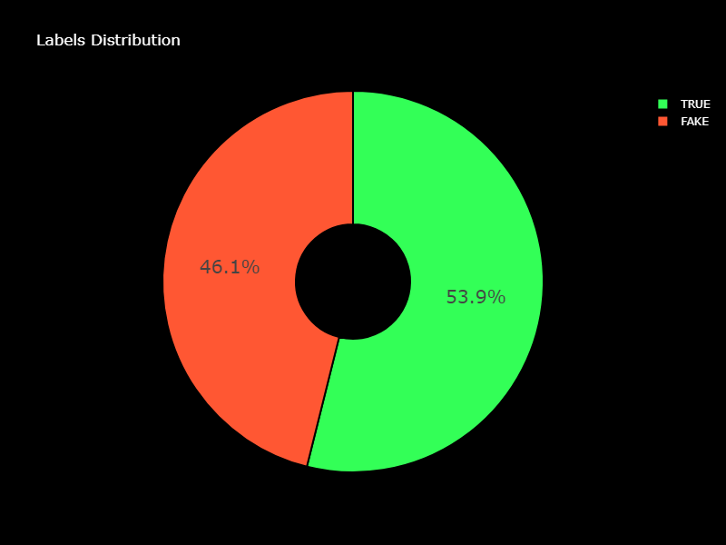
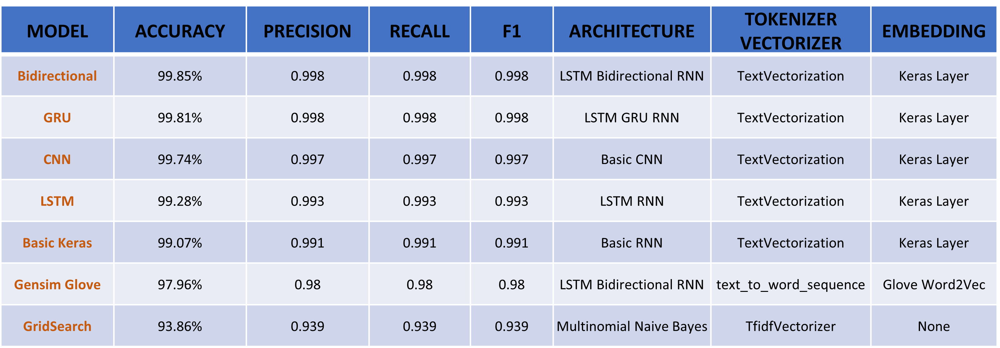

# NEWS CLASIFFICATION 🗞️

    

This repository hosts a notebook featuring an in-depth analysis of several **RNN** models, together with **CNN** and **Multinomial Naive Bayes** along with an app deployment using Streamlit. The following models were meticulously evaluated:

- Basic Multinomial Naive Bayes 
- Basic Keras Model
- LSTM Model
- LSTM GRU Model
- LSTM Bidirectional Model
    - TextVectorization + Keras Embedding
    - Text_to_word_sequence	+ Word2Vec Embedding
- Basic CNN Model

The dataset used has been downloaded from [Kaggle](https://www.kaggle.com/datasets/gpiosenka/100-bird-species) and contains a set of Fake and Real News.

The app can be tested following this [link](https://huggingface.co/spaces/bmartinc80/birds_pytorch).

## 👨‍💻 **Tech Stack**

## 📐 Set Up

In the first stage, a set of helper functions was created in order to easily visualize the data analysis and modelling results:

- **Plot WordCLoud**: Generate a word cloud for a specific label value and display it in a subplot
- **Plot Confusion Matrix**: Plot a confusion matrix to visualize classification results
- **Plot Precision/Recall Results**: Calculates model accuracy, precision, recall, and F1-score of a binary classification model and returns the results as a DataFrame

## 👨‍🔬 Data Analysis

The first approach was to analyze the dataset columns and ist distribution. The dataset contains the following columns, divided in two files (fake and true):

- Title
- Text
- Subject
- Date

    

After merging the datasets we see that the labels are pretty well balance as they are close to 50% each. So in this respect the is no need to do oversampling or undersampling. The number of news is 23481 (fake) and 21417 (true), after removal of duplicates (209 rows).

    

On the other hands, the subjects contains 8 topics, from which the 2 most popular are all true news and the other 6 fake. This means that there is no mix of labels within subjects.

    

    

Within the wordcloud, Trump and US are along the most common words in both labels.

    

## 👨📶 Preprocessing

Along with the data analysis, the following data preprocessing steps where taken in order to create a clean dataset for the further modelling step:

- Removal of duplicated rows
- Removal of rows with empty cells
- Merging of text and title column in a common column
- Cleaning of dataframe. This includes removal of punctuation, numbers, special characters, stopwords and lemmatization. 

This lead again to the creation of around 6'000 duplicated rows that were removed, leading to a final dataset of 38'835 rows, that still is well balanced.

    

## 👨‍🔬 Modelling

Sevel models were trained with different set ups, mainly 5 CNN models, 1 CNN and 1 Multinomial Naive Bayes.

    

All models perfomed very well reaching accuracies above 90%. In a first step it was set up a baseline model using GridSearch for a Multinomial Naive Bayes with TfidfVectorizer. Afterwards, all models with TextVectorization were tested reaching accuracies above 99%. Finally, the model with the best performance, LSTM Bidirectional, was again tested but this time with tokenizer and embedding (text_to_word_sequence + Word2Vec Embedding). Although, the model performed very well, it showed a lower accuracy than the other ones. 

# Project Overview

## 📐 Set Up

In the initial project phase, a set of essential helper functions was created to streamline data analysis and model evaluation. These functions include:

- **Plot Word Cloud**: Generates a word cloud for a specific label value and displays it in a subplot.
- **Plot Confusion Matrix**: Visualizes classification results using a confusion matrix.
- **Plot Precision/Recall Results**: Computes model accuracy, precision, recall, and F1-score for binary classification models, returning the results in a DataFrame.

## 👨‍🔬 Data Analysis

The first step of the project involved a comprehensive analysis of the dataset, including its columns and distribution. The dataset consists of two files (fake and true), each with the following columns:

- Title
- Text
- Subject
- Date

    

Upon merging the datasets, it became apparent that the labels are well-balanced, with both fake and true labels at approximately 50%, negating the need for oversampling or undersampling. The dataset initially contained 23,481 fake and 21,417 true news articles, with 209 duplicate rows removed.

### Labels Distribution

    

The subjects column revealed eight different topics, with genuine news and fake news being the two most prominent categories. This indicates a clear separation of labels within subjects.

### Subjects Distribution

    

### Subjects vs Labels Distribution

    

### WordCloud

A word cloud visualization showed that the terms "Trump" and "US" were among the most common words in both label categories.

    

## 👨📶 Data Preprocessing

In parallel with data analysis, several preprocessing steps were undertaken to create a clean dataset for further modeling:

- Removal of duplicate rows
- Elimination of rows with empty cells
- Merging of the text and title columns into a single column
- Dataframe cleaning, including punctuation removal, elimination of numbers, special character removal, stopword removal, and lemmatization

These steps resulted in approximately 6,000 duplicated rows, which were subsequently removed, resulting in a final dataset of 38,835 rows while maintaining a balanced label distribution.

### Final Labels Distribution

    

## 👨‍🔬 Modeling

The project involved training several models with varying configurations, primarily consisting of five CNN models, one CNN model combined with Multinomial Naive Bayes.

### Model Results

    

# Model Performance Evaluation

All models demonstrated impressive performance, consistently achieving high accuracies, frequently surpassing the 90% mark. The model evaluation process involved several steps:

1. **Baseline Model with GridSearch:**
   - A Multinomial Naive Bayes model was established using the TfidfVectorizer.
   - Despite being a basic model, it set the initial benchmark for performance.

2. **Advanced Models with TextVectorization:**
   - A series of models were tested with advanced text vectorization techniques.
   - These models consistently reached accuracies exceeding 99%.
   - The enhanced vectorization significantly improved model performance.

3. **Best-Performing Model: LSTM Bidirectional with Tokenization and Word Embedding:**
   - The LSTM Bidirectional model, known for its sequence modeling capabilities, was identified as the best performer.
   - It was further evaluated with tokenizer and embedding, specifically using `text_to_word_sequence` and Word2Vec embedding.
   - While the performance remained impressive, it exhibited a slightly lower accuracy compared to the other models.

## 👏 App Deployment

The last step was to deploy and app hosted in Hugging Face using Gradio. This app can be tested with available sample images or with own ones.

    

