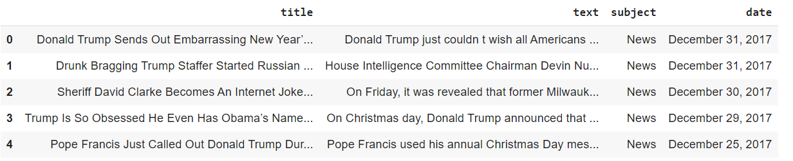
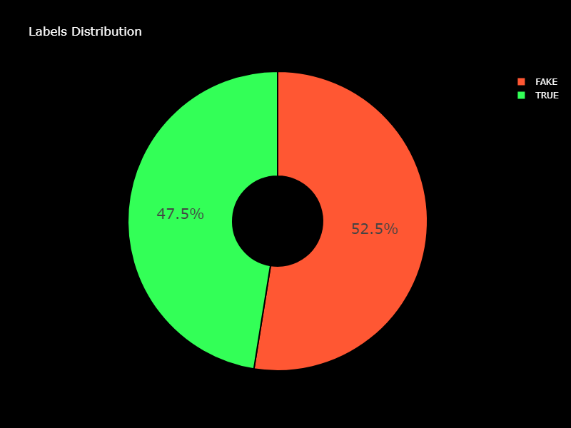
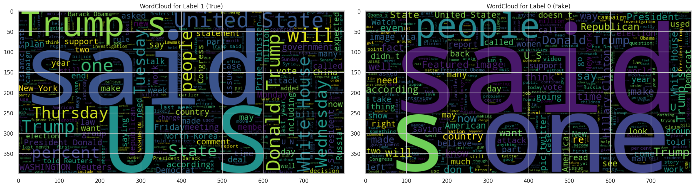
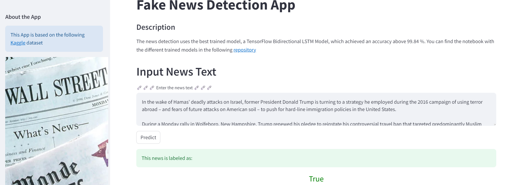

# NEWS CLASIFFICATION 🗞️

    

This repository hosts a notebook featuring an in-depth analysis of several **RNN** models, together with **CNN** and **Multinomial Naive Bayes** along with an app deployment using Streamlit. The following models were meticulously evaluated:

- Basic Keras Model
- LSTM Model
- LSTM GRU Model
- LSTM Bidirectional Model
    - TextVectorization + Keras Embedding
    - Text_to_word_sequence	+ Word2Vec Embedding
- Basic CNN Model

The dataset used has been downloaded from [Kaggle](https://www.kaggle.com/datasets/gpiosenka/100-bird-species) and contains a set of Fake and Real News.

The app can be tested following this [link](https://huggingface.co/spaces/bmartinc80/birds_pytorch).

## 👨‍💻 **Tech Stack**

## 📐 Set Up

In the first stage, a set of helper functions was created in order to easily visualize the data analysis and modelling results

- **Plot WordCLoud**: Generate a word cloud for a specific label value and display it in a subplot
- **Plot Confusion Matrix**: Plot a confusion matrix to visualize classification results
- **Plot Precision/Recall Results**: Calculates model accuracy, precision, recall, and F1-score of a binary classification model and returns the results as a DataFrame

## 👨‍🔬 Data Analysis

The first approach was to analyze the dataset columns and ist distribution. The dataset contains the following columns:

- Title
- Text

    

The labels are pretty well balance as they are close to 50% each.

    

On the other hands, the subjects contains 8 topics, from which the 2 most popular are all true news and the other 6 fake. This means that there is no mix of labels within subjects

    

    

Within the wordcloud, Trump and US are along the most common words in both labels

    

## 👨‍🔬 Preprocessing

Along with the data analysis, the following data preprocessing steps where taken in order to create a clean dataset for the further modelling step:

- Removal of duplicated rows
- Removal of rows with empty cells
- Merging of text and title column

## 👨‍🔬 Modelling

The first approach was to train 2 Pytorch EfficientNet models (EffNetB0, EffNetB2) with **5 and 10 epochs** using the pretrained model weights of EffNetB0 for the DataLoaders in order to stablish a baseline. The **EffNetB2 with 10 epochs** showed the best performance above **93%** on the test set.

## ↗️ Model Improvement

Then the EffNetB2 with 10 epochs was trained again but this time using the pretrained model weights of EffNetB2 for the DataLoaders. This time an accuracy above **95%** on the **test set** and above **93%** on the **validation set** was achieved .

    

## 👏 App Deployment

The last step was to deploy and app hosted in Hugging Face using Gradio. This app can be tested with available sample images or with own ones.

    

